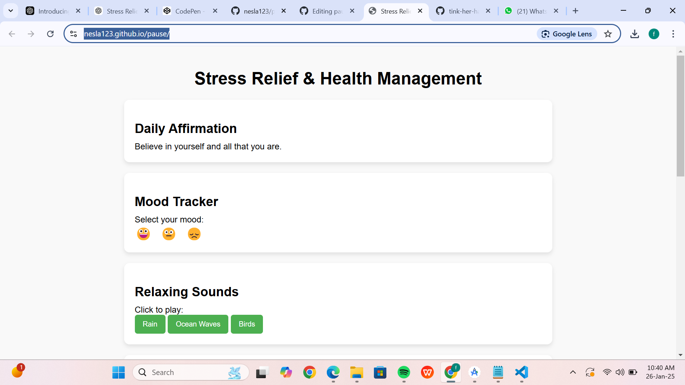
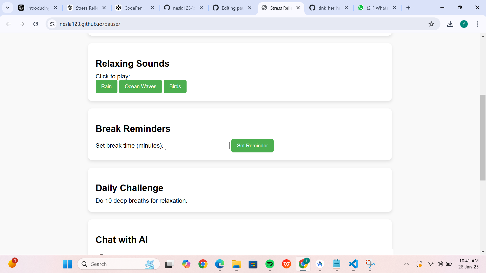
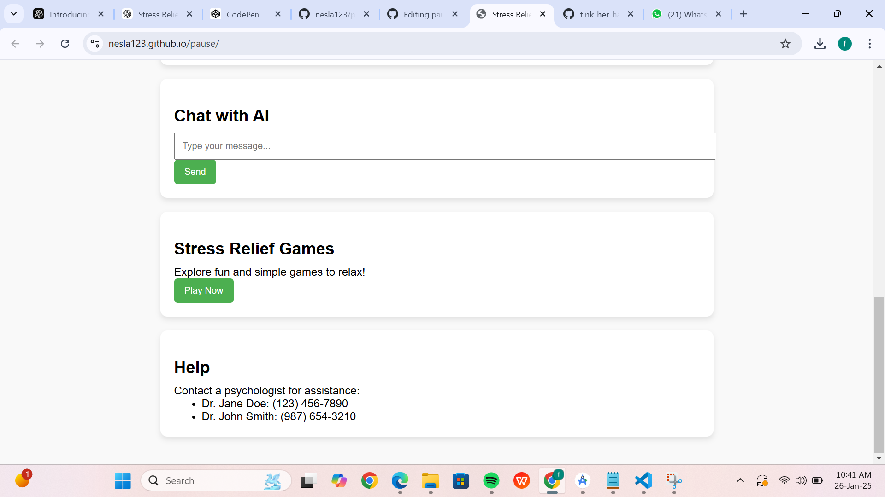

# Pause 🎯

## Basic Details
### Team Name: Nyla Hidha Nesla

### Team Members
- Member 1: fathima nesla - vidya academy of science and technology
- Member 2: hidha nazarin - vidya academy of science and technology

### Hosted Project Link
https://nesla123.github.io/pause/

### Project Description
This website offers practical tools and resources to help users manage stress and maintain a healthy mind. It provides relaxation exercises, mindfulness tips, and helpful content to promote mental well-being and emotional balance.

### The Problem statement
An accessible online platform offering tools and resources to help individuals manage stress and improve mental well-being.

### The Solution
Create a user-friendly website that provides stress-relief tools, including guided meditations, breathing exercises, calming visuals, and personalized mental wellness tips, accessible anytime and tailored to individual needs.

## Technical Details
### Technologies/Components Used
For Software:
- html,css,javascript
- vanilla javascript
- vscode

### Implementation
For Software:

### Project Documentation
For Software:

# Screenshots (Add at least 3)

# Diagrams

*Add caption explaining your workflow*

For Hardware:

# Schematic & Circuit

*Add caption explaining connections*

*Add caption explaining the schematic*

# Build Photos

*List out all components shown*

*Explain the build steps*

*Explain the final build*

### Project Demo
# Video
[Add your demo video link here]
*Explain what the video demonstrates*

# Additional Demos
[Add any extra demo materials/links]

## Team Contributions
- [Name 1]: [Specific contributions]
- [Name 2]: [Specific contributions]
- [Name 3]: [Specific contributions]

---
Made with ❤️ at TinkerHub
